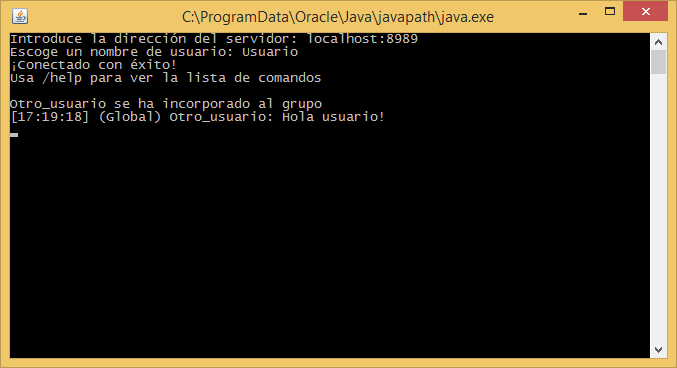
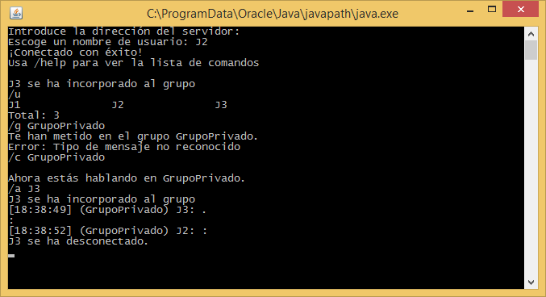
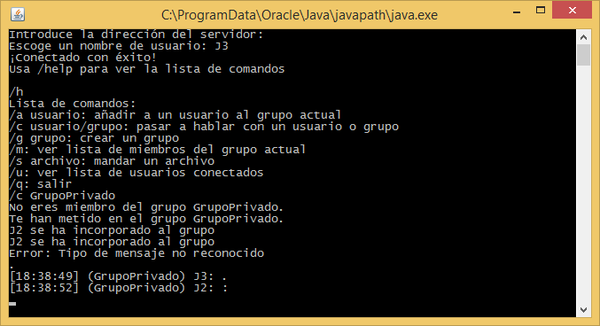
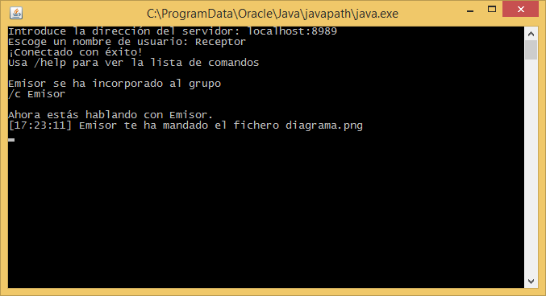
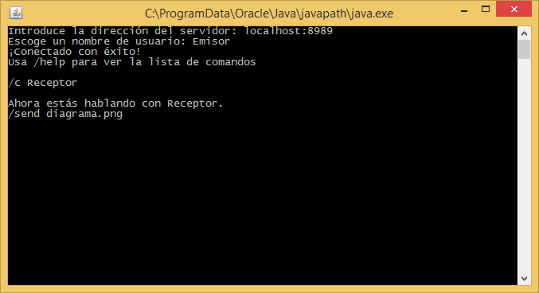

# Descripción de la aplicación, funcionalidad y actores que intervienen

Nuestro protocolo de aplicación consiste en la implementación de un **servicio de mensajería instantánea en tiempo real** con una arquitectura cliente-servidor. De esta forma, los actores que intervienen son:

- **Usuarios** (clientes): Los usuarios mandan mensajes a otros usuarios a través del servidor, tanto a usuarios individuales como a grupos de usuarios que definen previamente.
- **Servidor**: El servidor recibe los mensajes de los clientes y gestiona su envío a su destinatario o destinatarios, incluyendo la información necesaria para su correcta decodificación.

Para dar soporte a este servicio el protocolo implementado consta de 4 tipos de mensajes: mensajes de texto usuales, petición de creación de grupos y de reserva de nombres de usuario y mensajes de error (cuando no existe un grupo o usuario o no ha sido posible el envío de un mensaje).

Se utilizan 2 hebras en cada cliente para escuchar y enviar y $n +1$ hebras en el servidor donde $n$ es el número de usuarios conectados.

\newpage

# Diagrama de estados

Los únicos estados disponibles son con y sin nombre. Un usuario no puede realizar ninguna acción si no tiene nombre. Una vez solicita uno, si este está disponible y es correcto (cumple con las especificaciones de longitud y conjunto de caracteres a utilizar) puede realizar cualquier otra opción.

En cualquier momento un usuario puede solicitar su desconexión. En este momento el servidor enviara un mensaje al resto de usuarios indicando su desconexión y procederá a cerrar el socket que utilizaba con este cliente.

\newpage

# Mensajes que intervienen

## Cliente

| **Código** | **Cuerpo** | **Descripción**|
|------------|-----------------------|--------------------------------|
| 1000       | *user* | El cliente solicita el nombre *user* |
| 1001       | *user*, *time*, *contenido* | Envío de *contenido* a *user* |
| 1002       | *group*, *time*, *contenido* | Envío de *contenido* a *group* |
| 1003       | *user*, *group* | Solicita que se añada *user* a *group* |
| 1004       | *destinatario*, *nombrefichero*, *fichero* | Solicita el envío de *fichero* a *destinatario* |
| 1993       | *group* | Solicita la creación del grupo *group* |
| 1996       | *group* | Solicita la lista de usuarios del grupo *group* |
| 1999       | bye | El cliente solicita su desconexión |

## Servidor

| **Código** | **Cuerpo** | **Descripción** |
|------------|------------------------|---------------------------------|
| 2001 | *user* | El usuario *user* no existe |
| 2002 | *group* | El grupo *group* no existe |
| 2004 | *ERROR* | El último mensaje enviado estaba mal formado |
| 2005 | *user*, *group* | El usuario *user* ya estaba en el grupo *group* |
| 2006 | *group* | El grupo *group* está lleno |
| 2007 | *user* | El nombre *user* es inválido |
| 2008 | *user* | El nombre *user* está siendo usado |
| 1000 | *user* | Petición de nombre de usuario aceptada |
| 1001 | *user*, *time*, *mensaje* | *user* ha enviado en el tiempo *time* el mensaje *mensaje* |
| 1002 | *user*, *group*, *time*, *mensaje* | *user* ha enviado en *group* en el tiempo *time* el mensaje *mensaje* |
| 1004 | *user*, *group*, *nombrefichero*, *fichero* | *user* ha mandado *fichero* (opcionalmente a través de *group*) |
| 1994 | *end* | Indica el fin de la recepción de información de login |
| 1995 | *group* | Indica la existencia o la creación del grupo *group* |
| 1996 | *user*, *group* | *user* ha entrado al grupo *group* |
| 1997 | *user* | *user* se ha conectado |
| 1998 | *user* | *user* se ha desconectado |

\newpage

# Evaluación de la aplicación

## Conexión y comandos

En primer lugar los usuarios deben conectarse al servicio, proporcionando la dirección del servidor, un nombre de usuario válido y su contraseña. A continuación pueden utilizar los siguientes comandos para navegar:

- `/salir`, `/quit`, `/q`: Cierra la conexión
- `/conversacion`, `/c`: Cambia la conversación a la indicada
- `/lista`, `/l`: Muestra la lista de conversaciones
- `/usuarios`, `/u`: Muestra los usuarios conectados

La conexión se muestra así:

## Grupos

El sistema permite la creación de grupos. Los comandos adecuados son:

- `/grupo`, `/g`: Crea un grupo
- `/anadir`, `/a`: Añade un usuario a un grupo
- `/miembros`, `/m`: Muestra los usuarios del grupo actual

Los grupos se muestran así:

## Envío de ficheros

El envío de ficheros se realiza con el comando `/send`. Los usuarios receptores deben disponer de una carpeta *Recibidos* que no tenga un archivo con el mismo nombre del enviado. El envío se muestra así en cada usuario:

