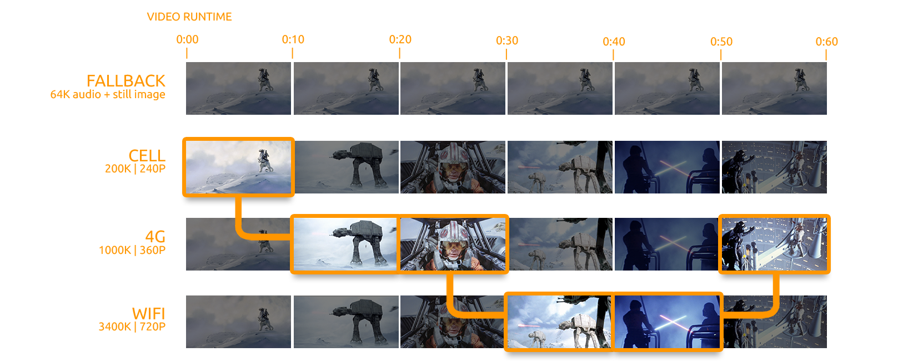

\newpage

# Qué es HLS

HLS (del inglés *HTTP Live Streaming*) es un protocolo de transmisión de contenido multimedia para streaming y vídeo bajo demanda (*VOD*) desarrollado por Apple. Sus principales características como protocolo de transmisión de vídeo son:

- Se distribuye **a través de HTTP** o HTTPS, es decir, utiliza el protocolo estándar en la web. Por ello, puede ser transmitido a través de un servidor web estándar.
- **Segmenta** los vídeos en fragmentos más pequeños que pueden ser descargados independientemente e intercambiados, que pueden tener diferentes dimensiones y *bitrates* de tal manera que se transmita el fragmento más adecuado según la calidad de la conexión en cada momento.

Además, este protocolo nos permite **encriptar** el contenido retransmitido, apoyándose en HTTPS para transmitir las claves a los clientes.

## Dispositivos que pueden utilizarlo

Al ser \HLS un protocolo diseñado por Apple los dispositivos de la misma (aquellos con iOS en una versión superior a iOS 3.0 y Apple TV) soportan por defecto este protocolo, así como su navegador Safari. Además, algunos dispositivos con Android soportan también este protocolo.

Sin embargo, los navegadores web más utilizados como Chrome, Firefox u Opera no soportan este protocolo de forma nativa, por lo que deben transformarse los segmentos descargados, usualmente utilizando JavaScript. Este procedimiento se describe en la sección *Utilización en dispositivos que no sean Apple*.

Otros programas que permiten la reproducción de vídeo o streaming en este formato son iTunes desde su versión 10.1 y VLC desde su versión 2. Una lista no exhaustiva de productos que permiten parcial o totalmente la reproducción de vídeo transmitido mediante \HLS puede consultarse [aquí](https://en.wikipedia.org/wiki/HTTP_Live_Streaming#Clients).

En la parte del servidor basta con un servidor HTTP usual configurado para especificar que los archivos índice se actualicen con mucha frecuencia de tal manera que la caché quede actualizada.

\newpage

## Visión general de la arquitectura


La arquitectura de un streaming o vídeo bajo demanda transmitido utilizando el protocolo \HLS se compone de las siguientes partes:

- En primer lugar un **codificador** de archivos multimedia convierte la(s) entrada(s) de audio o vídeo a los formatos aceptados. El estándar tal y como viene definido en el *Request for Comment* no indica la necesidad de utilizar un formato concreto; en la práctica se utiliza MPEG-2.<!--TODO: Cuáles son/con qué características?-->
- A continuación un **segmentador de flujo** divide la entrada de audio o vídeo en segmentos cortos (de unos 10 segundos de duración usualmente).
- Para la distribución el servidor web genera un **archivo de índice** que incluye los segmentos mencionados anteriormente así como información sobre estos: su calidad, *bitrate* y otros metadatos que necesite el cliente para reproducir el contenido.
- Este archivo así como los segmentos se transmiten mediante un **servidor HTTP** usual, recargando el archivo índice cuando se generen nuevos segmentos.
- El cliente **reconstruye el vídeo** a partir de los segmentos descargados de tal forma que la reproducción sea fluida.

Este esquema general puede complicarse utilizando otras características del protocolo como la transmisión de vídeo en distintos formatos o calidades para conexiones más lentas o como respaldo, el añadido de subtítulos o metadatos adicionales y la encriptación del contenido enviado.

## Diferencias entre versiones

Desde su versión inicial presentada en mayo de 2009 la especificación de \HLS ha sufrido múltiples cambios y han sido añadidas nuevas funcionalidades, contando en el momento presente con un total de 19 revisiones.

Este trabajo describe las características principales de \HLS en su versión 19 presentada este mismo año. A continuación presentamos una lista no exhaustiva de las nuevas funcionalidades y cambios que han añadido algunas versiones:

- Las versiones 02 a 05 añaden la capacidad de streams alternativos, añadido de metadatos y duraciones no enteras de los segmentos.
- Las versiones 07 a 11 introducen la capacidad de especificar segmentos como secciones contiguas de un fichero mayor, especificadas con `EXT-X-BYTERANGE`.
- Las versiones 14 a 16 reescriben algunas partes de la especificación y permiten especificar el ancho de banda medio.

# Funcionamiento del protocolo

En esta sección explicamos el funcionamiento de las distintas partes del protocolo detalladas en la visión general de la arquitectura.

## Codificación y segmentación

El vídeo se codifica en un formato que pueda ser reproducido por los posibles clientes y se segmenta en archivos `ts` junto con un archivo de índice `m3u8`. Esto puede efectuarse de una sola vez sobre un archivo de vídeo o audio preparado, o sobre la marcha en caso de una retransmisión en directo, en cuyo caso cada vez que un segmento es completado se actualiza el índice. El cliente podrá reconstruir el archivo o el flujo a partir de los segmentos.

El protocolo soporta posibles discontinuidades en las propiedades del contenido multimedia, como la codificación o las dimensiones. En estos casos se termina un segmento en la discontinuidad y en el índice se indica que el siguiente segmento, que comienza tras la discontinuidad, tiene una configuración distinta.

\HLS soporta además la transmisión de vídeo en distintas resoluciones para adaptarse a la calidad de la conexión del cliente. La relación de aspecto debe ser igual en las distintas resoluciones. Estas últimas se especificarán en el archivo índice maestro como se describe en la sección *Archivos de índice*.



## Tipos de sesión

\HLS soporta dos tipos de sesiones: eventos y vídeo bajo demanda.

El vídeo bajo demanda permite el acceso a cualquier segmento del contenido transmitido. Las ventajas que ofrece \HLS para la retransmisión de vídeo bajo demanda son la posibilidad de encriptado y el cambio entre distintas resoluciones en función de la calidad de la conexión.

Dentro de los eventos (las retransmisiones en directo) se distinguen a su vez dos tipos. El tipo por defecto sólo permite el acceso a los segmentos de una cierta ventana temporal, mientras que en el segundo caso puede accederse a cualquier segmento desde que empezó la retransmisión.

Además, debido a la estructura de los archivos índice (descritos en la siguiente sección) las retransmisiones en directo pueden ser convertidas en vídeo bajo demanda una vez hayan finalizado manteniendo el mismo archivo.

## Archivos de índice

Una vez generados los segmentos de vídeo se genera a su vez uno o varios archivos de índice. Estos archivos indican la duración, calidad y orden en el que aparecen los distintos segmentos de tal manera que el cliente pueda solicitarlos ordenadamente al servidor.

Los archivos de índice se organizan a través de un **archivo de índice maestro** que indica la localización del resto.

### Formato y sintaxis

El formato utilizado es `m3u8`, una extensión del formato `m3u`. `m3u` es un estándar *de facto* para la creación de listas de reproducción, bien de archivos disponibles en el cliente o bien de flujos de audio o vídeo transmitidos por Internet.

Los archivos `m3u` y `m3u8` consisten en ficheros de texto plano. La diferencia entre ambos radica en que `m3u` utiliza la codificación por defecto del sistema mientras que `m3u8` utiliza UTF-8 para su codificación. De esta forma `m3u8` permite la utilización de caracteres en una gran cantidad de alfabetos y lenguajes. Los archivos índice que no utilicen UTF-8 deben ser rechazados por el cliente según el estándar.

Los archivos índice sólo pueden tener líneas en blanco, URIs (usualmente URLs) o líneas que empiecen por `#`. Estas últimas son las líneas que añaden información sobre las URLs o el índice en cuestión.

La estructura de todo archivo índice debe ser:

<!-- TODO: no se muestran correctamente las listas dentro de las sublistas ni las dos últimas líneas -->
 - `#EXTM3U`: la primera línea debe ser la etiqueta que determina que el formato es `m3u8`.
 - Un subconjunto de la siguiente lista de etiquetas:
   - `#EXT-X-PLAYLIST-TYPE:tipo`, donde `tipo` es `VOD` (Vídeo bajo demanda, en cuyo caso el índice no debe cambiar) o `EVENT` (eventos, en cuyo caso el índice solo puede ser cambiado añadiendo fragmentos al final del mismo). Para una retransmisión en vivo que no garantice el almacenamiento de segmentos antiguos, puede no usarse esta etiqueta.
   - `#EXT-X-VERSION:N`, con `N` la versión del protocolo usada. Esta etiqueta permite retrocompatibilidad. Si no se usa, se supondrá que se usa la primera versión del protocolo.
   - `#EXT-X-TARGETDURATION:N`, siendo `N` la máxima duración que puede tener un segmento.
   - `#EXT-X-MEDIA-SEQUENCE:N`, con `N` el número de secuencia que se corresponde con el primer segmento. Puede no ser `0` si se trata de una retransmisión en vivo que no almacena los segmentos antiguos, en cuyo caso cada vez que se elimine el primer segmento este número debe incrementarse en 1.
 - Una lista con un elemento de la siguiente forma para cada segmento:
   - `#EXTINF:N`, siendo `N` un número en punto flotante que indica la duración del segmento. Típicamente es `10.0` para todos los segmentos salvo el último, aunque en caso de discontinuidad en las propiedades del vídeo podría haber más segmentos con longitud menor y el protocolo no obliga a que la longitud máxima sea `10.0`.
   - Una URL que apunte al segmento. Puede ser relativa o absoluta.

   Si dos de estos elementos usan segmentos con distinta codificación, puede informarse de ello al cliente mediante una línea la etiqueta `#EXT-X-DISCONTINUITY` entre ambos.
 - Opcionalmente puede terminar por la etiqueta `#EXT-X-ENDLIST`. La presencia de esta etiqueta indica que no se añadirán más fragmentos al índice.

Un ejemplo de un archivo índice para un vídeo bajo demanda con 4 segmentos de un total de 39 segundos de duración es:

\vspace*{0.75cm}

```
#EXTM3U
#EXT-X-PLAYLIST-TYPE:VOD
#EXT-X-TARGETDURATION:10
#EXT-X-VERSION:3
#EXT-X-MEDIA-SEQUENCE:0
#EXTINF:10.0,
http://example.com/movie1/fileSequenceA.ts
#EXTINF:10.0,
http://example.com/movie1/fileSequenceB.ts
#EXTINF:10.0,
http://example.com/movie1/fileSequenceC.ts
#EXTINF:9.0,
http://example.com/movie1/fileSequenceD.ts
#EXT-X-ENDLIST
```

\vspace*{0.75cm}

Si las rutas estuvieran expresadas de forma relativa, tal y como recomienda el estándar, bastaría indicar el nombre de cada fichero `.ts`.

### Archivo índice maestro


Para crear estructuras más complejas puede utilizarse una **lista de reproducción maestra**. Este archivo índice maestro (guardado también en `.m3u8`) proporciona una lista de flujos que los clientes pueden utilizar en función de sus preferencias. Algunas de las características posibles especificadas por el estándar e implementadas en el software de Apple son:

- Proporcionar vídeo en distintas resoluciones, *bitrates* y formatos
- Proporcionar flujos de respaldo en distintos servidores para evitar fallos
- Proporciona audio en distintos idiomas o con distintos vídeos (distintos ángulos de cámara etc.)

El cliente es responsable de cambiar entre estos flujos en función de sus preferencias y la calidad de su conexión. En el caso de la calidad, el primer flujo descrito en el archivo índice maestro será el que se utilice para realizar una prueba de la calidad de la conexión. La relación de aspecto de los distintos flujos ofrecidos debe ser la misma (4:3, 16:9), aunque la resolución puede variar. Esta se indica en el campo `RESOLUTION` de `EXT-X-STREAM-INF` para ayudar al cliente a decidir.

Los flujos de respaldo se utilizan en caso de que alguno de los flujos dé un error 404 o cualquier otro fallo. En caso de error el cliente escoge el siguiente flujo con más ancho de banda, escogiendo el que se encuentre antes en la lista si hay empate.

Un ejemplo de un archivo índice maestro con dos flujos con distinta calidad y flujos de respaldo (extraído de la documentación de Apple) es:

\vspace*{0.75cm}

```
#EXTM3U
#EXT-X-STREAM-INF:PROGRAM-ID=1, BANDWIDTH=200000, RESOLUTION=720x480
http://ALPHA.mycompany.com/lo/prog_index.m3u8
#EXT-X-STREAM-INF:PROGRAM-ID=1, BANDWIDTH=200000, RESOLUTION=720x480
http://BETA.mycompany.com/lo/prog_index.m3u8

#EXT-X-STREAM-INF:PROGRAM-ID=1, BANDWIDTH=500000, RESOLUTION=1920x1080
http://ALPHA.mycompany.com/md/prog_index.m3u8
#EXT-X-STREAM-INF:PROGRAM-ID=1, BANDWIDTH=500000, RESOLUTION=1920x1080
http://BETA.mycompany.com/md/prog_index.m3u8
```

\vspace*{0.75cm}

La primera línea identifica el archivo como un archivo índice. A continuación se listan las URLs de los archivos índice de los distintos flujos. Los primeros flujos indican una resolución baja mientras que los segundos tienen una resolución 1080p. El servidor `BETA` sirve de respaldo al servidor `ALPHA`. El estándar no limita el posible número de flujos de respaldo.

Aunque no es obligatorio, el estándar recomienda que el audio sea el mismo entre los distintos flujos aunque la calidad de la imagen varíe. Esto permite la transición entre estos sin *glitches* auditivos.

### Archivos índice durante la retransmisión en directo

Durante la retransmisión de un *streaming* se utiliza una única lista de reproducción que se va actualizando. Un ejemplo de un archivo índice en un cierto momento del *streaming* es:

\vspace*{0.75cm}

```
#EXTM3U
#EXT-X-TARGETDURATION:10
#EXT-X-VERSION:3
#EXT-X-MEDIA-SEQUENCE:2
#EXTINF:10,
fileSequence2.ts
#EXTINF:10,
fileSequence3.ts
#EXTINF:10,
fileSequence4.ts
#EXTINF:10,
fileSequence5.ts
#EXTINF:10,
fileSequence6.ts
```
\vspace*{0.75cm}

Como podemos ver `EXT-X-MEDIA-SEQUENCE` indica que el primer segmento disponible es el tercero ya que el *streaming* ha avanzado. Además observamos que no existe la etiqueta `EXT-X-ENDLIST` para indicar que esta lista se actualizará conforme avance el *streaming*. No se indica la etiqueta `EXT-X-PLAYLIST-TYPE` por lo que se asume *streaming*.

## Encriptación

Los segmentos `.ts` pueden ser encriptados individualmente. En este caso las referencias a las claves necesarias para desencriptarlos aparecen en el archivo índice para que el cliente pueda obtenerlo. Actualmente \HLS soporta encriptado AES-128 usando claves de 16 octetos. Las cabeceras de los segmentos no son encriptadas para transmitir la información sobre la longitud.

Puede utilizarse la misma clave para todos los segmentos o cambiar la clave cada $n$ segmentos. Las claves requieren además un vector de inicialización que también puede cambiar periódicamente.

Para mantener la seguridad es importante enviar las claves mediante HTTPS. No se recomienda en cambio transmitir los segmentos y archivos índice mediante HTTPS ya que esto impediría que los archivos enviados se almacenaran en caché, redirigiendo todas las peticiones a nuestro servidor.

Un ejemplo de un archivo índice con segmentos encriptados es:

\vspace*{0.75cm}

```
#EXTM3U
#EXT-X-VERSION:3
#EXT-X-MEDIA-SEQUENCE:7794
#EXT-X-TARGETDURATION:15

#EXT-X-KEY:METHOD=AES-128,URI="https://priv.example.com/key.php?r=52"

#EXTINF:2.833,
http://media.example.com/fileSequence52-A.ts
#EXTINF:15.0,
http://media.example.com/fileSequence52-B.ts
#EXTINF:13.333,
http://media.example.com/fileSequence52-C.ts

#EXT-X-KEY:METHOD=AES-128,URI="https://priv.example.com/key.php?r=53"

#EXTINF:15.0,
http://media.example.com/fileSequence53-A.ts
```
\vspace*{0.75cm}

Como podemos ver la etiqueta `EXT-X-KEY` especifica el método de encriptación y la localización de la clave (que se sirve mediante HTTPS) para cada colección de segmentos hasta que se indique una nueva clave (en este caso cada 3 segmentos). Si hubiera segmentos no encriptados se debería indicar mediante una etiqueta `EXT-X-KEY` que el método de encriptado es `NONE`.

El cliente detectará el método indicado y utilizará la clave provista para desencriptar en tiempo real los segmentos solicitados.

## Añadir metadatos adicionales

Además de la transmisión del audio y vídeo \HLS permite la transmisión de metadatos que acompañen a los segmentos, como, en el caso de la transmisión de música, información sobre el artista o el nombre de la canción. Estos metadatos adicionales pueden acompañar el audio en formato `id3`.

Otros metadatos posibles son los subtítulos. \HLS soporta subtítulos o *closed-captions* que sigan la especificación `WebVTT`. Este formato permite la aplicación de estilo utilizando CSS y otros metadatos semánticos. Un ejemplo de archivo índice maestro con múltiples subtítulos, obtenido de la documentación de Apple, es:

\vspace*{0.75cm}

```
#EXTM3U

#EXT-X-MEDIA:TYPE=CLOSED-CAPTIONS,GROUP-ID="cc",
NAME="CC1",LANGUAGE="en",DEFAULT=YES,AUTOSELECT=YES,INSTREAM-ID="CC1"
#EXT-X-MEDIA:TYPE=CLOSED-CAPTIONS,GROUP-ID="cc",
NAME="CC2",LANGUAGE="sp",AUTOSELECT=YES,INSTREAM-ID="CC2"

#EXT-X-STREAM-INF:BANDWIDTH=1000000,SUBTITLES="subs",CLOSED-CAPTIONS="cc"
x.m3u8
```
\vspace*{0.75cm}

Como vemos se incluyen subtítulos en inglés y español, para los que se especifica una id de grupo (`cc`) que posteriormente se indica en el stream adecuado. La especificación de la duración de cada segmento de vídeo permite la sincronización de los subtítulos.

Los subtítulos también pueden dividirse en segmentos que se transmiten junto con los segmentos de audio y vídeo durante el stream (para permitir subtítulos simultáneos con una transmisión en directo). Estos segmentos se especifican en la etiqueta `#EXT-X-STREAM-INF`.

# Implementación en el cliente

La visualización de contenido suministrado siguiendo el protocolo \HLS puede hacerse con cualquiera de los dispositivos mencionados en *Dispositivos que pueden utilizarlo*. En la práctica es común visualizar este tipo de contenidos mediante un navegador, de tal manera que el cliente no tenga que instalar *software* adicional. En estas secciones especificamos como integrar \HLS en HTML, tanto en dispositivos Apple como en aquellos que no tienen un soporte nativo.

## En navegadores con soporte nativo

En dispositivos y navegadores con soporte nativo basta utilizar el elemento `video` de HTML5 especificando como URL en la fuente (mediante el campo `src`) el archivo índice maestro del streaming o vídeo bajo demanda a reproducir:

```html
<html>
<head>
    <title>Ejemplo con soporte nativo</title>
</head>
<body>
    <video
        src="http://ejemplo.com/streaming.m3u8"
        height="300" width="400"
        >
    </video>
</body>
</html>
```

Si queremos podemos utilizar las capacidades de JavaScript para modificar el comportamiento y visualización del contenido a través de las funciones definidas para `video`. Estas permiten la reproducción automática y la asociación de la reproducción/pausa del contenido a partir de acciones en la página.

## En navegadores sin soporte nativo

\HLS tiene soporte por defecto en dispositivos Apple, en Safari y en las versiones para iOS y Android del navegador Google Chrome. Para el resto de dispositivos es necesario adaptar el protocolo para asegurar la reproducción utilizando JavaScript.

La biblioteca más común es `hls.js`, desarrollada por Dailymotion. Esta librería convierte los segmentos de vídeo recibidos y los representa a través de la especificación Media Source Extensions.

Esta especificación permite la captación, precaptación y el almacenamiento en buffer de contenido multimedia utilizando JavaScript.

Un ejemplo mínimo del código necesario para utilizar esta librería es:

```html
<html>
<head>
    <title>Ejemplo con soporte nativo</title>
</head>
<body>
  <!-- Código de hls.js -->
  <script src="https://cdn.jsdelivr.net/hls.js/latest/hls.min.js"></script>
  <video id="video"></video>
  <script>
    if(Hls.isSupported()) { // Si hay soporte para HLS
      var video = document.getElementById('video');
      var hls = new Hls();
      hls.loadSource('http://ejemplo.com/streaming.m3u8'); // Carga el stream
      hls.attachMedia(video); // Muéstralo en vídeo
      hls.on(Hls.Events.MANIFEST_PARSED,function() {
        video.play(); // Reprodúcelo automáticamente
    });
   }
  </script>
</body>
</html>
```

\newpage

\input{bibliografia}
